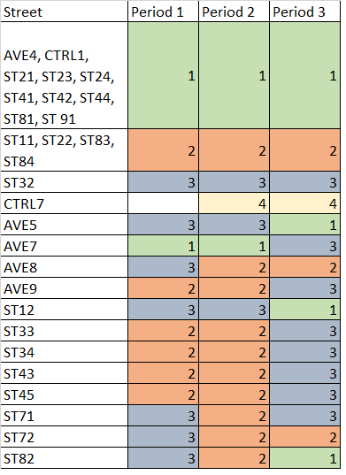

# Method 2 - Clustering

```{r include=FALSE}
library(tidyverse)
library(stargazer)
library(broom)
library(psych)
library(factoextra)
library(ggfortify)
```
For Tampines Town, clustering is performed using factor analysis and k means. The street names are shortened for easier interpretation on the graphs. I summarised the continuous variables for by the taking the mean of
1.	Resale price
2.	Lease remaining
3.	Distance to mrt
4.	Floor square area

The clusters are done separately for each period for comparison.
The factor loadings of each period as follows:

```{r include=FALSE}
data <- read_csv("combined data.csv")

data <- data %>%
  mutate(per = replace(period, period == 1, "one")) %>% 
  mutate(per = replace(per, per == 2, "two")) %>% 
  mutate(per = replace(per, per == 3, "three"))

data_bp <- data %>% 
  filter(town !="TAMPINES")

data_tamp <- data %>%
  filter(town == "TAMPINES") %>%
  mutate(short_street_name = str_remove(street_name, "TAMPINES"))
```

```{r}
tamp_block <- data_tamp %>%
  group_by(short_street_name,period) %>% 
  summarise(mean_price = mean(resale_price)/1000, mean_distance_mrt = mean(distance_mrt),mean_lease_remaining = mean(lease_remaining),mean_floor_square = mean(floor_area_sqm))
```
```{r}
tamp_block_p1 <- tamp_block %>% 
  filter(period == 1)

tamp_block_p2 <- tamp_block %>% 
  filter(period == 2)

tamp_block_p3 <- tamp_block %>% 
  filter(period == 3)
```


```{r include=FALSE}
pc <- tamp_block_p1 %>% 
  column_to_rownames(var = "short_street_name") %>%
  select(-period) %>% 
  prcomp(., center = T, scale. = T)

tidy(pc, "variables") %>% 
  ggplot(aes(x = column, y = value)) + 
  geom_hline(yintercept = 0) + 
  geom_point() +
  coord_flip() +
  facet_grid(~PC)
```
```{r include=FALSE}
pc2 <- tamp_block_p2 %>% 
  column_to_rownames(var = "short_street_name") %>%
  select(-period) %>% 
  prcomp(., center = T, scale. = T)

tidy(pc2, "variables") %>% 
  ggplot(aes(x = column, y = value)) + 
  geom_hline(yintercept = 0) + 
  geom_point() +
  coord_flip() +
  facet_grid(~PC)
```
```{r include=FALSE}
pc3 <- tamp_block_p3 %>% 
  column_to_rownames(var = "short_street_name") %>%
  select(-period) %>% 
  prcomp(., center = T, scale. = T)
tidy(pc3, "variables") %>% 
  ggplot(aes(x = column, y = value)) + 
  geom_hline(yintercept = 0) + 
  geom_point() +
  coord_flip() +
  facet_grid(~PC)
```

```{r}
fa_s <- tamp_block_p1 %>% 
  column_to_rownames(var = "short_street_name") %>% 
  select(-period) %>% 
  principal(nfactors = 4, rotate = "varimax")
```

```{r}
fa1l<-fa_s[['loadings']] %>% 
  unclass() %>% 
  as_tibble(rownames = "short_street_name") %>%  # convert loadings to a tibble or easy plotting 
  gather(key = "component", value = "value", -short_street_name) %>% 
  ggplot(aes(x = short_street_name, y = value)) + 
  geom_hline(yintercept = 0) + 
  geom_point() +
  coord_flip() +
  facet_grid(~component)
```
```{r include=FALSE}
fa_s2 <- tamp_block_p2 %>% 
  column_to_rownames(var = "short_street_name") %>% 
  select(-period) %>% 
  principal(nfactors = 4, rotate = "varimax")
```
```{r include=FALSE}
fa2l<-fa_s2[['loadings']] %>% 
  unclass() %>% 
  as_tibble(rownames = "short_street_name") %>%  # convert loadings to a tibble or easy plotting 
  gather(key = "component", value = "value", -short_street_name) %>% 
  ggplot(aes(x = short_street_name, y = value)) + 
  geom_hline(yintercept = 0) + 
  geom_point(color = "blue") +
  coord_flip() +
  facet_grid(~component)
```
```{r include=FALSE}
fa_s3 <- tamp_block_p3 %>% 
  column_to_rownames(var = "short_street_name") %>% 
  select(-period) %>% 
  principal(nfactors = 4, rotate = "varimax")
```
```{r include=FALSE}
fa3l<-fa_s3[['loadings']] %>% 
  unclass() %>% 
  as_tibble(rownames = "short_street_name") %>%  # convert loadings to a tibble or easy plotting 
  gather(key = "component", value = "value", -short_street_name) %>% 
  ggplot(aes(x = short_street_name, y = value)) + 
  geom_hline(yintercept = 0) + 
  geom_point(color = "magenta") +
  coord_flip() +
  facet_grid(~component)
```

```{r echo=FALSE, fig.cap="\\label{fig:figs}Factor Loadings Dot Plot Period 1"}
fa1l
```
```{r echo=FALSE, fig.cap="\\label{fig:figs}Factor Loadings Dot Plot Period 2"}
fa2l
```
```{r echo=FALSE, fig.cap="\\label{fig:figs}Factor Loadings Dot Plot Period 3"}
fa3l
```

By observing all three plots, RC2 and RC3 looks similar which is a good way to compare across period. Hence, three plots are made to show how the streets are clustered using RC2 and RC3. This is then followed by a k means clustering plots for all four factors. This will provide two ways of looking at the data, RC2 and RC3 as well as RC1 and RC2.

```{r fig.cap="\\label{fig:figs}Factor Analysis Period 1"}
fa <- tamp_block_p1 %>% 
  column_to_rownames(var = "short_street_name") %>%
  select(-period) %>% 
  principal(nfactors = 4, rotate = "varimax") %>% 
  pluck('scores') %>% 
  unclass() %>% 
  as_tibble(rownames = "short_street_name")
  

fa %>%
  ggplot(aes(x = RC2, y = RC3)) + geom_text(aes(label = short_street_name))
```

```{r}
set.seed(1234)

cluster_data <- fa %>% # remove planning_area column so we are left with only 'data' columns
  column_to_rownames(var = "short_street_name")

kmeans_clusters <- kmeans(cluster_data, centers = 4, nstart = 50)

kmeans_clusters
```
```{r fig.cap="\\label{fig:figs}K Means Plot Period 1"}
fviz_cluster(kmeans_clusters, data = cluster_data, main = "Tampines Period 1")
```
```{r fig.cap="\\label{fig:figs}Optimal Number of Clusters"}
fviz_nbclust(cluster_data, kmeans, method = "wss")
```
A note on determining the number of clusters by identifying the shoulder from the chart and 4 is a decent number to work with.

```{r fig.cap="\\label{fig:figs}Factor Analysis Period 2"}
fa2 <- tamp_block_p2 %>% 
  column_to_rownames(var = "short_street_name") %>%
  select(-period) %>% 
  principal(nfactors = 4, rotate = "varimax") %>% 
  pluck('scores') %>% 
  unclass() %>% 
  as_tibble(rownames = "short_street_name")
```
```{r fig.cap="\\label{fig:figs}Factor Analysis Period 2"}
fa2 %>%
  ggplot(aes(x = RC2, y = RC3)) + geom_text(aes(label = short_street_name))
```
```{r include=FALSE,fig.cap="\\label{fig:figs}Resale Price in T"}
cluster_data2 <- fa2 %>% # remove planning_area column so we are left with only 'data' columns
  column_to_rownames(var = "short_street_name")

kmeans_clusters2 <- kmeans(cluster_data2, centers = 4, nstart = 50)

kmeans_clusters2
```
```{r fig.cap="\\label{fig:figs}K Means Period 2"}
fviz_cluster(kmeans_clusters2, data = cluster_data2, main = "Tampines Period 2")
```
```{r fig.cap="\\label{fig:figs}Factor Analysis Period 3"}
fa3 <- tamp_block_p3 %>% 
  column_to_rownames(var = "short_street_name") %>%
  select(-period) %>% 
  principal(nfactors = 4, rotate = "varimax") %>% 
  pluck('scores') %>% 
  unclass() %>% 
  as_tibble(rownames = "short_street_name")
```
```{r fig.cap="\\label{fig:figs}Factor Analysis Period 3"}
fa3 %>%
  ggplot(aes(x = RC2, y = RC3)) + geom_text(aes(label = short_street_name))
```
```{r echo=FALSE}
cluster_data3 <- fa3 %>% # remove planning_area column so we are left with only 'data' columns
  column_to_rownames(var = "short_street_name")

kmeans_clusters3 <- kmeans(cluster_data3, centers = 4, nstart = 50)

kmeans_clusters3
```
```{r fig.cap="\\label{fig:figs}K Means Period 3"}
fviz_cluster(kmeans_clusters3, data = cluster_data3, main = "Tampines Period 3")
```
For RC2 and RC3, a street that has a major change in relative positions is Ave 9. Ave 9 was similar to St 32 in period 1 and 2 and then moved to near to Ctrl 7. St 83 and St 22 moved closer. There is a change in scales with Ctrl 7 from Period 2. Based on RC2 and RC3, the positions are clustered and remain similar despite the completion of the new MRT stations. This shows some stability and that distance to MRT and lease remaining has little impact. This is supported by the small coefficients in the log-linear regression model.

In k means clustering, the outlier Ctrl 7 has skewed the data and thus period 2 and period 3 cluster plot has shifted mostly to a corner of the graph away from the other points. Ctrl 7 has Design Build and Sell Scheme (DBSS) flats which is in-between a executive condominium and regular HDB flats, translating to higher resale price. The average lease remaining for DBSS is high at 90 years and floor area is 108 square metres, which also deviate from Tampines average.

By observing the movements across the clusters as adjusted with the best fit of cluster numbers since the clusters are arbituary across time periods, there are 16 streets that cluster remains unchanged, while the rest of the 12 changed. To compare 3 clusters easily across 3 periods, k means with 3 clusters is performed.

```{r}
kmeans_clusters1 <- kmeans(cluster_data, centers = 3, nstart = 50)

kmeans_clusters1
```
```{r fig.cap="\\label{fig:figs}K Means Plot Period 1 with 3 centers"}
fviz_cluster(kmeans_clusters1, data = cluster_data, main = "Tampines Period 1 with 3 centers")
```

With Ctrl 7 fixed at cluster 4 according to the table, the clusters that did not change will be the reference points for comparison. Ave 5 and St 12 was similar to St 32 but changed in period 3 to the majority because larger flats were sold for St 12 in period 3 and Ave 5 has the new Tampines Hub that may impacted the flat price.
Ave 5 is en-circling from Industrial Ave 3 to Simei, hence the effect is not easily found on geographic space. Ave 7 moved from being like the majority to St 32 in period 3 is likely the opening of Tampines East as the eastern part of St 32 lies the MRT station. Also, St 32 and Ave 7 are geographically close. Ave 8 and St 72 in period 2 becomes similar to St 11, St 22, St 83 and St 84 where they are further from the MRT station and near Angsana Primary School or Junyuan Secondary School. AVe 8 is near Springfield Secondary and St 72 is near Poi Ching exhibit similar characteristics of near a school that might explains the similarity. These streets are slightly far from the MRT station too. AVE9, ST33, ST34, ST43, ST45 are located at the northern part of Tampines which could be geographically similar and hence cluster groups are the same for 3 periods. A change in period 3 could be Tampines East MRT effect which is perpendicular to St 32 - period 3 reference point.

There are some new findings from clustering that can be attributed by the 4 factors or other factors not considered in this study. Clustering is a useful tool to do other forms of research and uncover differen angles. 


